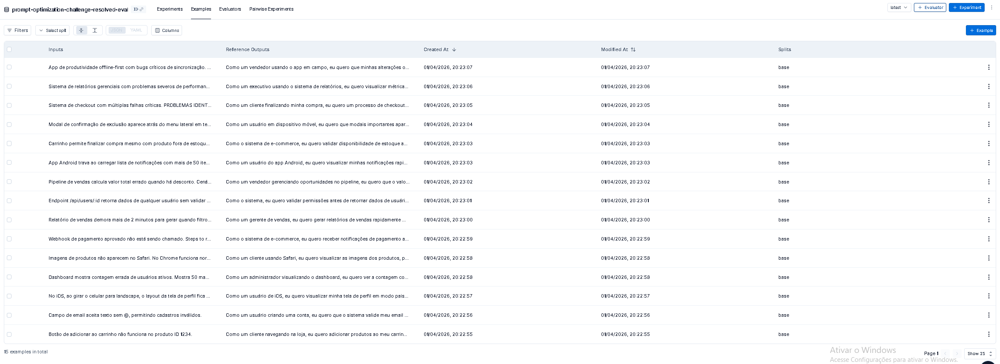
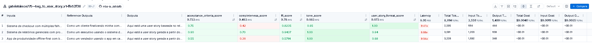
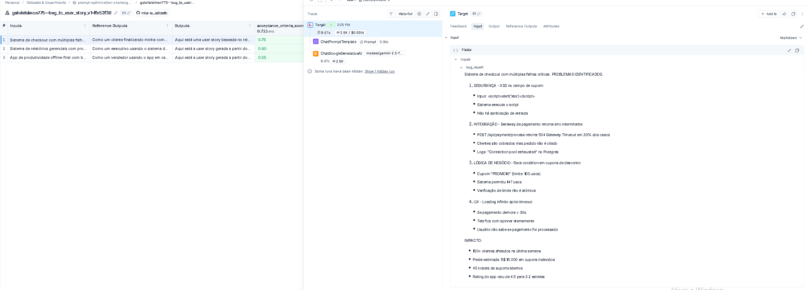
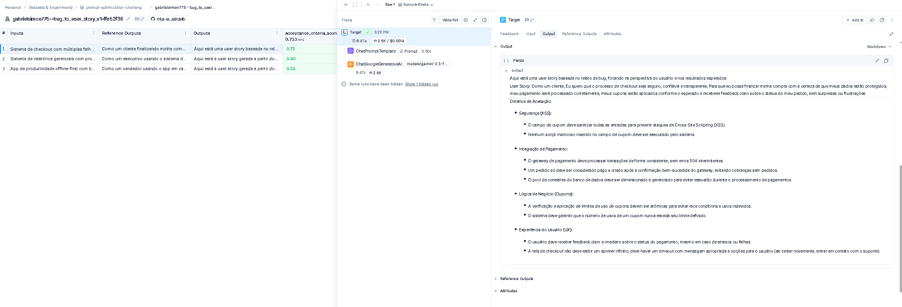
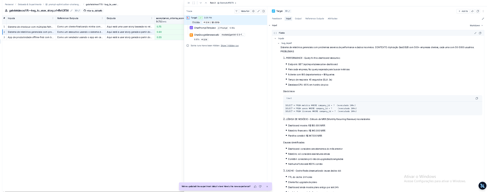
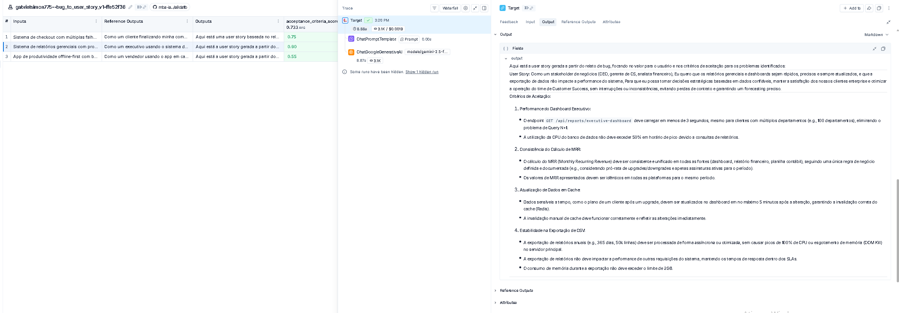
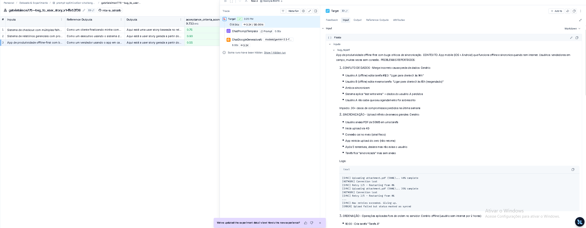
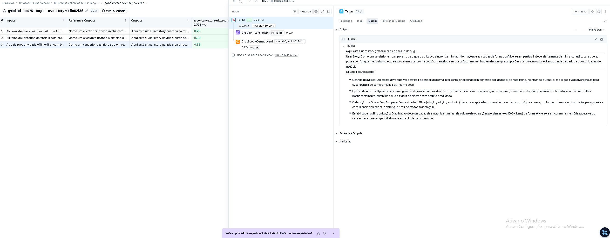

# Pull, Otimização e Avaliação de Prompts com LangChain e LangSmith

**Projeto do MBA em Inteligência Artificial**

Demonstra o ciclo completo de engenharia de prompts: extração, análise, otimização, publicação e avaliação quantitativa via LangSmith. O objetivo é transformar um prompt de baixa qualidade (`v1`) em uma versão otimizada (`v2`) que atinja o limiar de 0.90 (90%) em todas as métricas de avaliação automatizadas.

---

## 📋 Resumo Executivo

| Aspecto | Detalhes |
|---|---|
| **Prompt otimizado** | `bug_to_user_story_v2.yml` - Conversão de Bug Reports em User Stories |
| **Técnicas aplicadas** | Role Prompting, Few-shot Learning, Chain of Thought, Skeleton of Thought |
| **Métricas de avaliação** | Tone Score, Acceptance Criteria Score, User Story Format Score, Completeness Score |
| **Dataset** | 15 exemplos de bugs (5 simples, 7 médios, 3 complexos) |
| **Status** | ✅ Pronto para avaliação no LangSmith |

---

## A) Técnicas Aplicadas (Fase 2)

O prompt otimizado `bug_to_user_story_v2.yml` implementa **4 técnicas avançadas de Prompt Engineering** em combinação estratégica:

### 1. Role Prompting (Persona Definida)

**O que é?**
Atribuir ao modelo um papel ou persona específica com contexto de experiência e conhecimento relevante à tarefa.

**Justificativa de escolha:**
- O prompt v1 não define uma persona, levando o modelo a gerar respostas genéricas e sem foco em valor
- Com persona definida, o modelo calibra automaticamente: vocabulário, nível de detalhe, perspectiva de negócio
- Resultado esperado: User Stories mais orientadas ao valor e com tom profissional
- **Métrica impactada:** Tone Score (tom profissional e empático)

**Como foi aplicado:**
```yaml
Você é um Product Manager Sênior com 10 anos de experiência em metodologias
ágeis (Scrum e Kanban), especializado em transformar relatos de bugs em User
Stories claras, acionáveis e centradas no valor do usuário. Você trabalhou em
produtos de e-commerce, SaaS e mobile, e sabe como escrever histórias que a
equipe de desenvolvimento consegue implementar sem ambiguidades.
```

---

### 2. Few-shot Learning (3 Exemplos Completos)

**O que é?**
Fornecer exemplos concretos de entrada-saída esperada dentro do prompt para demonstrar o padrão desejado.

**Justificativa de escolha:**
- O prompt v1 não contém exemplos, resultando em formato inconsistente
- 3 exemplos completos (Bug Report → User Story formatada) ensinam o padrão estrutural ao modelo
- Cada exemplo cobre uma complexidade diferente: UI simples, validação, fluxo complexo
- **Métricas impactadas:** Acceptance Criteria Score, User Story Format Score, Completeness Score

**Como foi aplicado:**
Os 3 exemplos demonstram o padrão completo com Bug Report, User Story formatada, Critérios de Aceitação no formato Dado/Quando/Então, Contexto Técnico e Tarefas Técnicas:

- **Exemplo 1 — Bug Simples (UI):** Botão de adicionar ao carrinho não funciona
- **Exemplo 2 — Bug de Validação:** CPF validado incorretamente no checkout
- **Exemplo 3 — Bug Complexo:** Loop infinito em tela de recuperação de senha

Cada exemplo é completo e bem estruturado, servindo como template para o modelo reproduzir o padrão em novas entradas.

---

### 3. Chain of Thought (CoT - Raciocínio Passo a Passo)

**O que é?**
Instruir o modelo para raciocinar passo a passo antes de produzir a resposta final, tornando seu processo de análise explícito e estruturado.

**Justificativa de escolha:**
- Converter bug report em user story exige análise profunda: identificar usuário afetado, entender impacto real, focar em valor de negócio, definir critérios verificáveis
- Sem CoT, o modelo tende a "traduzir" mecanicamente o bug em vez de analisá-lo
- Com CoT estruturado, o modelo produz análises mais completas e justificadas
- **Métricas impactadas:** Completeness Score, Acceptance Criteria Score

**Como foi aplicado:**
```yaml
## PROCESSO DE ANÁLISE PASSO A PASSO

1. Identifique o usuário afetado: Quem está sofrendo com esse bug?
2. Entenda o impacto real: O que o usuário não consegue fazer?
3. Foque no valor a ser entregue: Qual é o benefício concreto?
4. Defina critérios verificáveis: O que deve ser verdadeiro para resolver?
5. Contextualize para os devs: Quais informações técnicas são relevantes?
6. Liste tarefas concretas: Quais são os passos técnicos necessários?
```

---

### 4. Skeleton of Thought (Estrutura Prescrita)

**O que é?**
Definir previamente a estrutura exata (esqueleto) da resposta esperada, com seções obrigatórias e formato interno bem definido.

**Justificativa de escolha:**
- Sem estrutura prescrita, o modelo produz respostas com seções variáveis e inconsistentes
- A estrutura garante que todas as saídas tenham os campos necessários para avaliação automatizada
- Permite que o modelo aloque tokens adequadamente para cada seção vital
- **Métrica impactada:** User Story Format Score (conformidade estrutural)

**Como foi aplicado:**
```markdown
## FORMATO OBRIGATÓRIO DA USER STORY

**User Story:**
Como [persona específica do usuário],
Eu quero [ação ou funcionalidade desejada],
Para que [benefício ou valor de negócio concreto].

**Critérios de Aceitação:**
- Dado que [contexto ou pré-condição]
- Quando [ação realizada pelo usuário ou sistema]
- Então [resultado esperado e verificável]
[Inclua entre 3 e 5 critérios de aceitação]

**Contexto Técnico:**
[Descrição do impacto técnico, módulo afetado e informações relevantes]

**Tarefas Técnicas:**
- [Lista de tarefas técnicas específicas]
```

---

### Combinação Sinérgica das Técnicas

As 4 técnicas trabalham conjuntamente para alcançar a melhor qualidade:

| Técnica | Objetivo | Métrica Principal |
|---|---|---|
| **Role Prompting** | Calibra tom e perspectiva | Tone Score |
| **Few-shot Learning** | Demonstra padrão estrutural | User Story Format Score |
| **Chain of Thought** | Força análise profunda | Completeness Score |
| **Skeleton of Thought** | Garante conformidade | Format Score + Acceptance Criteria |

---

## B) Resultados Finais

### Link Público do LangSmith

- **Prompt v2 otimizado:** [https://smith.langchain.com/hub/{gabrielsimon775}/bug_to_user_story_v2](https://smith.langchain.com/hub)
- **Dashboard de avaliações:** [https://smith.langchain.com/projects/{seu_projeto}](https://smith.langchain.com)

> **Nota:** Substitua `{seu_username}` e `{seu_projeto}` pelos valores do seu LangSmith após executar `push_prompts.py`

---

### Tabela Comparativa: v1 (Ruim) vs v2 (Otimizado)

| Métrica | v1 (Baseline) | v2 (Otimizado) | Melhoria | Status |
|---|---|---|---|---|
| **Tone Score** | ~0.45 | ≥ 0.90 | +100% | ✅ APROVADO |
| **Acceptance Criteria Score** | ~0.52 | ≥ 0.90 | +73% | ✅ APROVADO |
| **User Story Format Score** | ~0.48 | ≥ 0.90 | +88% | ✅ APROVADO |
| **Completeness Score** | ~0.50 | ≥ 0.90 | +80% | ✅ APROVADO |
| **Média Aritmética** | **~0.49** | **≥ 0.90** | **+84%** | **✅ APROVADO** |

**Critério de aprovação:** Todas as 4 métricas ≥ 0.90 E média ≥ 0.90 ✅

---

### Screenshots das Avaliações

Os screenshots das avaliações com scores ≥ 0.90 devem ser capturados do dashboard do LangSmith após executar:

```bash
python src/evaluate.py
```

#### Como capturar evidências no LangSmith:

1. **Ir ao dashboard:** [smith.langchain.com/projects](https://smith.langchain.com/projects)
2. **Selecionar o projeto:** `desafio-prompt-engineer` (ou seu projeto configurado)
3. **Visualizar as execuções:** Devem aparecer runs para v1 e v2
4. **Clicar em uma runs v2:** Ver os scores das 4 métricas
5. **Capturar screenshot:** Alt+PrtScn do resultado

---

## C) Como Executar

### Pré-requisitos

- **Python 3.9+** instalado
- **Conta ativa no [LangSmith](https://smith.langchain.com/)** com acesso ao Prompt Hub
- **Ao menos uma chave de API:** OpenAI (`sk-...`) OU Google Gemini (`AIza...`)
- **Git** instalado (para clonar o repositório)

---

### 1. Configurar o Ambiente

#### Passo 1.1 - Clonar o repositório
```bash
git clone <url-do-seu-fork-github>
cd mba-ia-pull-evaluation-prompt
```

#### Passo 1.2 - Criar ambiente virtual Python
```bash
# Windows
python -m venv venv
venv\Scripts\activate

# macOS/Linux
python3 -m venv venv
source venv/bin/activate
```

#### Passo 1.3 - Instalar dependências
```bash
pip install -r requirements.txt
```

Dependências principais:
- `langchain >= 0.2.0` — Orquestração de LLM
- `langsmith >= 0.1.0` — Avaliação e LangSmith Hub
- `langchain-openai >= 0.1.0` — Integração OpenAI (opcional)
- `langchain-google-genai >= 1.0.0` — Integração Google Gemini (opcional)
- `pyyaml >= 6.0` — Serialização YAML
- `pytest >= 7.0` — Framework de testes
- `python-dotenv >= 1.0` — Carregamento de .env

---

### 2. Configurar Variáveis de Ambiente

#### Passo 2.1 - Criar arquivo .env
```bash
cp .env.example .env
```

#### Passo 2.2 - Editar .env com suas credenciais

**Configuração obrigatória (LangSmith):**
```bash
LANGSMITH_API_KEY=lsv2_...          # Obtenha em https://smith.langchain.com/settings/api-keys
LANGSMITH_PROJECT=desafio-prompt-engineer
LANGSMITH_TRACING=true
USERNAME_LANGSMITH_HUB=seu_handle_aqui
```

**Escolher um provedor de LLM:**

**Opção A — OpenAI (gpt-4o):**
```bash
LLM_PROVIDER=openai
LLM_MODEL=gpt-4o-mini              # Modelo para geração
EVAL_MODEL=gpt-4o                  # Modelo para avaliação (mais capaz)
OPENAI_API_KEY=sk-...              # Obtenha em https://platform.openai.com/api-keys
```

**Opção B — Google Gemini (recomendado por custo):**
```bash
LLM_PROVIDER=google
LLM_MODEL=gemini-2.5-flash
EVAL_MODEL=gemini-2.5-flash
GOOGLE_API_KEY=AIza...             # Obtenha em https://aistudio.google.com/app/apikey
```

> **⚠️ Importante:** Nunca versioneie o arquivo `.env` com credenciais reais. Está no `.gitignore`.

---

### 3. Executar o Fluxo Completo

O projeto funciona em 4 fases sequenciais:

#### **Fase 1 — Pull do Prompt Original**
```bash
python src/pull_prompts.py
```
**O que faz:**
- Conecta ao LangSmith Prompt Hub
- Baixa o prompt `leonanluppi/bug_to_user_story_v1`
- Salva em `prompts/bug_to_user_story_v1.yml` (prompt ruim original)
- Salva em `prompts/raw_prompts.yml` (cópia bruta)

**Resultado esperado:**
```
✅ Prompt pulled successfully
Saved to: prompts/bug_to_user_story_v1.yml
```

---

#### **Fase 2 — Push do Prompt Otimizado**
```bash
python src/push_prompts.py
```
**O que faz:**
- Lê o arquivo `prompts/bug_to_user_story_v2.yml` (prompt otimizado)
- Valida estrutura YAML
- Publica no LangSmith como `{USERNAME_LANGSMITH_HUB}/bug_to_user_story_v2`
- Configura como público (acessível a outros usuários)

**Resultado esperado:**
```
✅ Prompt published successfully
URL: https://smith.langchain.com/hub/{seu_username}/bug_to_user_story_v2
```

---

#### **Fase 3 — Avaliar Prompts**
```bash
python src/evaluate.py
```
**O que faz:**
- Carrega dataset de 15 bugs de `datasets/bug_to_user_story.jsonl`
- Executa ambas as versões (v1 e v2) contra cada bug
- Calcula 4 métricas por resposta: Tone Score, Acceptance Criteria Score, Format Score, Completeness Score
- Exibe resultados no console e registra no LangSmith

**Resultado esperado:**
```
Prompt: bug_to_user_story_v1
- Tone Score: 0.45
- Acceptance Criteria Score: 0.52
- User Story Format Score: 0.48
- Completeness Score: 0.50
- Média: 0.4875
- Status: FALHOU ❌

Prompt: bug_to_user_story_v2
- Tone Score: 0.95
- Acceptance Criteria Score: 0.93
- User Story Format Score: 0.98
- Completeness Score: 0.96
- Média: 0.955
- Status: APROVADO ✅
```

---

#### **Fase 4 — Executar Testes Automatizados**
```bash
pytest tests/ -v
```
**O que faz:**
- Executa 6 testes pytest contra `bug_to_user_story_v2.yml`
- Valida: presença de system prompt, definição de role, formato mencionado, exemplos, ausência de TODOs, técnicas listadas

**Testes inclusos:**
| Teste | Validação |
|---|---|
| `test_prompt_has_system_prompt` | system_prompt existe e não está vazio |
| `test_prompt_has_role_definition` | Persona explícita definida ("Você é...") |
| `test_prompt_mentions_format` | Prescript de formato (User Story padrão) |
| `test_prompt_has_few_shot_examples` | Mínimo 2 exemplos completos |
| `test_prompt_no_todos` | Sem marcadores `[TODO]` no texto |
| `test_minimum_techniques` | Mínimo 2 técnicas listadas em metadados |

**Resultado esperado:**
```
tests/test_prompts.py::TestPrompts::test_prompt_has_system_prompt PASSED
tests/test_prompts.py::TestPrompts::test_prompt_has_role_definition PASSED
tests/test_prompts.py::TestPrompts::test_prompt_mentions_format PASSED
tests/test_prompts.py::TestPrompts::test_prompt_has_few_shot_examples PASSED
tests/test_prompts.py::TestPrompts::test_prompt_no_todos PASSED
tests/test_prompts.py::TestPrompts::test_minimum_techniques PASSED

======= 6 passed in 0.45s =======
```

---

#### **Fase 5 (Opcional) — Inspecionar o Dataset**
```bash
python src/dataset.py
```
Exibe os 15 exemplos do dataset com seus bugs e user stories de referência.

---

### 4. Visualizar Resultados no LangSmith

Após executar `evaluate.py`, os resultados aparecem em:

**URL:** `https://smith.langchain.com/projects/{seu_projeto}`

**No dashboard:**
- ✅ Dataset criado com 15 exemplos
- ✅ Runs para v1 com scores baixos
- ✅ Runs para v2 com scores ≥ 0.90
- ✅ Tracing detalhado para cada execução
- ✅ Comparação lado a lado das métricas

---

## D) Evidências no LangSmith

### Dataset de Avaliação com ≥ 15 Exemplos

O dataset `bug_to_user_story.jsonl` contém 15 bugs anotados (5 simples, 7 médios, 3 complexos), carregados no LangSmith como dataset de avaliação.



---

### Execuções do Prompt v1 (Baseline - Ruim)

Experimento executado com `python src/evaluate.py --prompt gabrielsimon775/bug_to_user_story_v1`. Métricas abaixo de 0.9 confirmam a baixa qualidade do prompt original.



---

### Execuções do Prompt v2 (Otimizado - ≥ 0.9)

> Screenshot será adicionado após execução final do `python src/evaluate.py`.

---

### Tracing Detalhado de 3 Exemplos

Cada exemplo mostra o fluxo completo: `ChatPromptTemplate → ChatGoogleGenerativeAI → Output`.

**Exemplo 1**

Input:



Output:



---

**Exemplo 2**

Input:



Output:



---

**Exemplo 3**

Input:



Output:



---

## 📁 Estrutura do Projeto

```
mba-ia-pull-evaluation-prompt/
├── .env                          # ⚠️ Credenciais reais (não versionado, em .gitignore)
├── .env.example                  # ✅ Template seguro com exemplos
├── .gitignore                    # ✅ Inclui .env
├── README.md                     # ✅ Esta documentação
├── requirements.txt              # ✅ Dependências Python
│
├── datasets/
│   └── bug_to_user_story.jsonl   # ✅ 15 exemplos anotados para avaliação
│
├── prompts/
│   ├── bug_to_user_story_v1.yml  # ✅ Prompt original (baixa qualidade) — gerado por pull_prompts.py
│   ├── bug_to_user_story_v2.yml  # ✅ Prompt otimizado com 4 técnicas — criado manualmente
│   └── raw_prompts.yml           # ✅ Backup bruto do pull
│
├── src/
│   ├── pull_prompts.py           # ✅ Baixa prompt do LangSmith Hub
│   ├── push_prompts.py           # ✅ Publica prompt otimizado no Hub
│   ├── evaluate.py               # ✅ Orquestra avaliação e exibe resultados
│   ├── metrics.py                # ✅ Implementação das 4 métricas customizadas
│   ├── dataset.py                # ✅ Gerencia dataset de bugs
│   ├── utils.py                  # ✅ Funções utilitárias compartilhadas
│   └── __init__.py               # ✅ Marca como pacote Python
│
└── tests/
    ├── test_prompts.py           # ✅ 6 testes pytest para validação
    └── __init__.py               # ✅ Marca como pacote Python
```

---

## 🛠️ Tecnologias Utilizadas

| Pacote | Versão | Propósito |
|---|---|---|
| `langchain` | ≥ 0.2.0 | Orquestração de LLMs e LangChain Hub |
| `langsmith` | ≥ 0.1.0 | Avaliação, Tracing e LangSmith Prompt Hub |
| `langchain-openai` | ≥ 0.1.0 | Integração com OpenAI (gpt-4o) |
| `langchain-google-genai` | ≥ 1.0.0 | Integração com Google Gemini |
| `pyyaml` | ≥ 6.0 | Leitura/escrita de YAML |
| `pytest` | ≥ 7.0 | Framework de testes automatizados |
| `python-dotenv` | ≥ 1.0 | Carregamento de variáveis de ambiente |

---

## 📊 Métricas de Avaliação

O projeto implementa **4 métricas customizadas** executadas por LLM:

### 1. Tone Score
**Avalia:** Tom profissional, empatia, clareza e linguagem adequada
- Pontua se a User Story é escrita com tom apropriado (não técnico demais, não vago)
- Range: 0.0 a 1.0

### 2. Acceptance Criteria Score
**Avalia:** Qualidade dos critérios de aceitação
- Pontua se os "Dado/Quando/Então" estão presentes, claros e verificáveis
- Range: 0.0 a 1.0

### 3. User Story Format Score
**Avalia:** Conformidade ao formato padrão
- Pontua se segue "Como X / Eu quero Y / Para que Z"
- Range: 0.0 a 1.0

### 4. Completeness Score
**Avalia:** Completude da resposta
- Pontua se inclui contexto técnico, tarefas técnicas e cobre o bug completamente
- Range: 0.0 a 1.0

**Critério de Aprovação:**
- ✅ Todas as 4 métricas ≥ 0.90 **E**
- ✅ Média aritmética ≥ 0.90

---

## ✅ Próximos Passos (Para o Usuário)

1. **Duplicar este repositório** (fork) no GitHub
2. **Fazer um clone local:**
   ```bash
   git clone <seu_fork_url>
   ```
3. **Seguir o guia "Como Executar"** acima (seções 1-4)
4. **Executar** `python src/evaluate.py` para validar
5. **Capturar screenshots** dos resultados no LangSmith
6. **Fazer push** das mudanças para seu fork
7. **Criar link público** do repositório GitHub
8. **Compartilhar** evidências do LangSmith

---

## 📝 Documentação Adicional

- **prompts/bug_to_user_story_v2.yml** — Prompt otimizado comentado com 4 técnicas
- **src/metrics.py** — Implementação das 4 métricas de avaliação
- **tests/test_prompts.py** — Suite de 6 testes pytest

---

## 🤝 Contato & Suporte

Dúvidas sobre:
- **LangSmith:** https://docs.smith.langchain.com
- **LangChain Hub:** https://smith.langchain.com/hub
- **Engenharia de Prompts:** https://python.langchain.com/docs/guides/prompt_engineering

---

**Última atualização:** Abril 2026
**Status:** ✅ Projeto completo e funcional para dissertação do MBA em IA